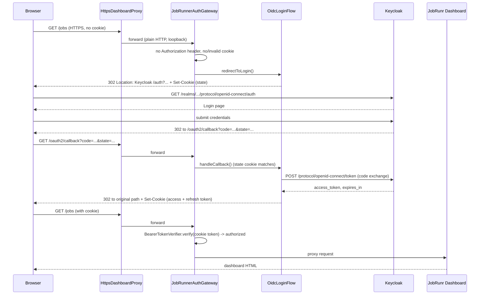

# Job Runner UI - Keycloak Authentication

**Repository:** `federator`
**Description:** `how the Job Runner (JobRunr) dashboard authenticates against Keycloak`

<!-- SPDX-License-Identifier: OGL-UK-3.0 -->

---

## Overview

The federator client embeds [JobRunr](https://www.jobrunr.io/) to run and monitor background jobs, and exposes JobRunr's own web dashboard ("Job Runner UI") for operational visibility - triggering, requeuing, and deleting jobs, and viewing recurring job state.

JobRunr's own dashboard server has no authentication and no TLS support. Both are added by this codebase, entirely in front of the dashboard, without modifying JobRunr itself:

1. **`HttpsDashboardProxy`** - terminates TLS on the port actually exposed to the outside world (JobRunr's own dashboard only ever binds plain HTTP on an internal-only port).
2. **`JobRunnerAuthGateway`** - a reverse proxy sitting behind the TLS layer that verifies every request carries a valid Keycloak-issued token before forwarding it to the real dashboard.

When both are enabled, requests flow: **browser → `HttpsDashboardProxy` (public, TLS) → `JobRunnerAuthGateway` (verifies auth) → JobRunr's dashboard (internal-only, plain HTTP)**.

All of this lives under `uk.gov.dbt.ndtp.federator.client.jobs` / `...client.jobs.auth`, wired up by `DefaultJobSchedulerProvider`.

## Two ways to authenticate

`JobRunnerAuthGateway` supports exactly one verification mechanism (a Keycloak-issued JWT, checked by `BearerTokenVerifier`), but two ways for that token to arrive:

| Caller | How it presents the token | Failure behaviour |
|---|---|---|
| **API / curl / Postman** | A literal `Authorization: Bearer <token>` header (name/scheme configurable), obtained however the caller likes (`client_credentials`, a manual `password` grant, etc.) | A missing/invalid token gets a plain `401`/`403` - no redirect, so scripts and tools behave predictably |
| **Real browser** | Nothing at first - the gateway itself runs an OpenID Connect **authorization code flow** against Keycloak, then stores the resulting access token in an HttpOnly cookie | A missing/invalid/expired token/cookie gets a `302` redirect straight to Keycloak's login page |

The gateway decides which path applies per request: if the bearer header is present at all, it's treated as an API caller (strict, no redirects, even if browser login is also configured); only when the header is absent does it fall back to the cookie / redirect-to-login flow. This means the same deployment serves curl-based automation and human browser access without any extra configuration.

Two further refinements narrow when a `302` redirect is actually attempted, rather than a plain `401`:

- **Non-navigation requests never get redirected**, even with no bearer header. The dashboard's own SPA makes background `fetch()`/`EventSource` calls (stats polling, live-update streams) that can never usefully follow a redirect to Keycloak's cross-origin login page anyway - the browser blocks reading that response (no CORS headers on Keycloak's login page), reporting a confusing `"blocked by CORS policy"` console error instead of a clean, expected failure. `JobRunnerAuthGateway` distinguishes these via the `Sec-Fetch-Mode` request header (`navigate` for a real page load; `cors`/`no-cors`/`same-origin` for everything else) - only `navigate` (or the header being absent entirely, e.g. Safari, which never sends Fetch Metadata headers - treated conservatively as "assume navigation" so a real page load is never wrongly denied a redirect) is eligible for the redirect-to-login flow.
- **A short list of public static assets bypass the auth check entirely** (`PUBLIC_ASSET_SUFFIXES` in `JobRunnerAuthGateway`: currently `/manifest.json`, `/favicon.ico`) - non-sensitive content the dashboard's own HTML references, proxied straight through regardless of token/cookie state or request mode. This is the one case handled unconditionally rather than via `Sec-Fetch-Mode`, since it should work identically on every browser (including Safari).

There is deliberately **no external login-proxy** (no oauth2-proxy, no ingress-level auth) - the whole OIDC dance is implemented in `OidcLoginFlow`, invoked directly by `JobRunnerAuthGateway`. An earlier iteration used oauth2-proxy as a sidecar; it was removed because its Kubernetes resource name wasn't parameterised per environment, causing the `dpn01` and `dpn02` deployments (which share one namespace) to collide on the same Service/Deployment.

## Browser login sequence (OIDC authorization code flow)



Key mechanics:

- **State/CSRF protection**: `redirectToLogin()` generates a random `state` token and stores it, together with the originally requested path (base64url-encoded), in a short-lived (`Max-Age=300`) `jobrunr_oidc_state` cookie. `handleCallback()` rejects the callback unless the `state` query parameter matches.
- **`redirect_uri` is fixed, not derived from the request**: because `HttpsDashboardProxy` forwards to the gateway over an internal loopback connection, the gateway never sees the browser's real hostname. `jobs.dashboard.auth.oidc.public.base.url` must be set explicitly to the externally-reachable HTTPS address, and it must exactly match a redirect URI registered on the Keycloak client.
- **The access token cookie** (`jobs.dashboard.auth.oidc.cookie.name`, default `jobrunr_at`) is `HttpOnly`, `SameSite=Lax`, and `Secure` unless explicitly disabled (`jobs.dashboard.auth.oidc.cookie.secure=false`, useful for local testing over plain HTTP). Its `Max-Age` matches the token's own `expires_in`.
- **Silent refresh on expiry**: if Keycloak's token response included a `refresh_token`, it's stored in a second cookie (`jobs.dashboard.auth.oidc.refresh.cookie.name`, default `jobrunr_rt`, same attributes as the access token cookie). When the access token fails verification, `JobRunnerAuthGateway` calls `OidcLoginFlow.tryRefresh()` *before* falling back to a visible redirect: it exchanges the refresh token cookie for a new access token via `grant_type=refresh_token` and re-verifies, all within the same request/response - no redirect, no interruption. This matters because a background `fetch()`/`EventSource` call from the dashboard's own SPA (periodic stats polling, live-update streams) can't follow a redirect to a cross-origin Keycloak login page anyway - the browser blocks reading that response (no CORS headers on Keycloak's login page), so without silent refresh, an expired token would only get properly recovered when the user manually reloads the page (triggering a fresh top-level navigation). Only when the refresh token is also missing/expired does the gateway fall back to the full `redirectToLogin()`/401 behaviour described above.

## Token verification (`BearerTokenVerifier`)

Regardless of which path supplied the token, verification is identical:

1. Parse the JWT and read its `kid` header.
2. Fetch the matching RSA public key from the realm's JWKS endpoint (`jobs.dashboard.auth.jwks.url`, or derived as `<issuer.url>/protocol/openid-connect/certs`). Keys are cached (`jobs.dashboard.auth.jwks.cache.ttl.seconds`, default 300s); an unrecognised `kid` forces one cache refresh before giving up, to tolerate Keycloak key rotation without a restart.
3. Verify the RS256 signature.
4. Check expiry (`exp`), issuer (`iss` must equal `jobs.dashboard.auth.issuer.url`, if set), and audience (`aud`/`azp` must contain `jobs.dashboard.auth.audience`, if set).
5. Resolve an **access level** from the token's roles.

### Role resolution and access levels

Two independent, optional roles gate two independent access levels:

- `jobs.dashboard.auth.admin.role` → `AccessLevel.ADMIN` (full access: view + trigger/requeue/delete)
- `jobs.dashboard.auth.reader.role` → `AccessLevel.READER` (view-only: GET/HEAD/OPTIONS)
- Neither role held → `AccessLevel.NONE`, rejected from everything
- If **both** properties are left blank, role gating is disabled entirely - any successfully authenticated caller gets `ADMIN`.

`JobRunnerAuthGateway` maps the required level from the HTTP method: read-only verbs need `READER`, everything else needs `ADMIN`. A `READER` token attempting a mutating call gets `403 Forbidden`.

Roles are read from **three** possible claim shapes, all checked and merged:

- `realm_access.roles` (Keycloak's standard nested shape)
- `resource_access.<audience>.roles` (client-specific roles, only checked when `audience` is configured)
- a **flat top-level `roles` claim** - this realm's `dpn-service-client` protocol mapper (shared by every UI in the platform) emits roles this way rather than the Keycloak-standard nested shape, so `BearerTokenVerifier` was extended to read both. Missing this would silently make role-gated access unresolvable for every caller, regardless of how the token was obtained.

## TLS trust for the JWKS fetch and token exchange

Both the JWKS fetch (`BearerTokenVerifier`) and the OIDC token-endpoint call (`OidcLoginFlow`) need to trust whatever certificate Keycloak presents - often signed by an internal/private CA rather than a public one. `DefaultJobSchedulerProvider.buildAuthHttpClientSupplier()` builds one `HttpClient` reused by both, trying trust sources in order:

1. **Vault-sourced trust material**, when `VaultTlsSupport.isVaultTlsEnabled()`.
2. **`client.truststoreFilePath`** / `client.truststorePassword` - the same mTLS truststore the client already uses elsewhere (gRPC to the federator server, etc.).
3. **`jobs.dashboard.auth.trustStore` / `.trustStoreType` / `.trustStorePassword`** JVM system properties - a dedicated trust store isolated from the JVM-wide `javax.net.ssl.trustStore` (which other code, e.g. Kafka's OAuth client, may set to something unrelated). In Azure this is populated from the same Kafka truststore secret via `-D` flags in `federator-client-deployment.yaml`.
4. Falls back to the JDK default trust store (fine for publicly-trusted certificates, or plain HTTP in local testing).

## Configuration reference

All properties live under `jobs.dashboard.auth.*` (see `JobRunnerAuthProperties`):

| Property | Purpose | Default |
|---|---|---|
| `jobs.dashboard.auth.enabled` | Master switch | `false` |
| `jobs.dashboard.auth.issuer.url` | Keycloak realm issuer, e.g. `https://host/realms/dpn-realm` | - |
| `jobs.dashboard.auth.jwks.url` | JWKS endpoint override | derived from `issuer.url` |
| `jobs.dashboard.auth.audience` | Expected `aud`/`azp` | not checked if unset |
| `jobs.dashboard.auth.admin.role` / `.reader.role` | Role-to-access-level mapping | not checked if unset |
| `jobs.dashboard.auth.header.name` / `.header.scheme` | Header an API caller presents the token on | `Authorization` / `Bearer` |
| `jobs.dashboard.auth.jwks.cache.ttl.seconds` | JWKS cache TTL | `300` |
| `jobs.dashboard.auth.port` | The gateway's own bind port (must differ from `jobs.dashboard.port`) | `jobs.dashboard.port + 10000` |
| `jobs.dashboard.auth.oidc.client.id` / `.client.secret` | Keycloak client used for the browser login | - (browser login disabled unless **both** set) |
| `jobs.dashboard.auth.oidc.redirect.path` | Path the gateway treats as the OIDC callback | `/oauth2/callback` |
| `jobs.dashboard.auth.oidc.scope` | OIDC scope requested | `openid` |
| `jobs.dashboard.auth.oidc.cookie.name` / `.cookie.secure` | Access-token cookie settings | `jobrunr_at` / `true` |
| `jobs.dashboard.auth.oidc.refresh.cookie.name` | Refresh-token cookie name (used for silent renewal on access-token expiry; only set if Keycloak issues a refresh token) | `jobrunr_rt` |
| `jobs.dashboard.auth.oidc.public.base.url` | Externally-reachable HTTPS base URL, used to build `redirect_uri` | - (required when browser login is enabled) |

`jobs.dashboard.auth.oidc.client.id`/`.client.secret` must both be set together, or both left blank - a `ConfigurationException` is thrown at startup otherwise. If they are set, `jobs.dashboard.auth.oidc.public.base.url` becomes mandatory too.

## Azure deployment specifics

- `federator-client-config.yaml` renders `jobs.dashboard.auth.oidc.client.id` from the same value as `jobs.dashboard.auth.audience` (the shared `dpn-service-client`), and `jobs.dashboard.auth.oidc.public.base.url` from `https://<federatorClient.name>.<namespace>.svc.cluster.local:<jobRunnerPort>`.
- The OIDC client secret is **not** baked into the ConfigMap - it's left blank there and overridden at JVM startup via `-Djobs.dashboard.auth.oidc.client.secret="$KAFKA_OAUTH_CLIENT_SECRET"` in `federator-client-deployment.yaml`, reusing the same Key Vault-sourced secret Kafka's own OAuth already pulls (`PropertyUtil` only applies a system-property override to a key that already exists in the properties file).
- The Keycloak realm (`dpn-authentication-service/charts/keycloak/dpn-realm.json`) must have each federator client's `<public.base.url>/oauth2/callback` registered as a `redirectUri` (and the bare host as a `webOrigin`) on `dpn-service-client` - see `uiHosts.federatorClient1`/`federatorClient2` in that chart's `values.yaml`.
- Each environment's `oauth2Proxy` block, if left over from the earlier design, should stay `enabled: false` - it is no longer used.

## Local testing

For local browser testing, run the local `dpn-keycloak` container (`docker/docker-grpc-resources/docker-compose-shared.yml`, realm `dpn-realm`, published on `https://localhost:8543`) alongside `FederatorClient` (run from the IDE, using `tmp/federator-secrets-bcc/client-bcc.properties`, gitignored/local-only). Set:

```properties
jobs.dashboard.https.enabled=true
jobs.dashboard.https.port=8085
jobs.dashboard.auth.enabled=true
jobs.dashboard.auth.issuer.url=https://localhost:8543/realms/dpn-realm
jobs.dashboard.auth.oidc.client.id=dpn-service-client
jobs.dashboard.auth.oidc.client.secret=<local realm client secret>
jobs.dashboard.auth.oidc.public.base.url=https://localhost:8085
```

Browsing `https://localhost:8085` then redirects straight to the local Keycloak's login page; a test user needs the configured admin/reader realm role to get past authorization.
